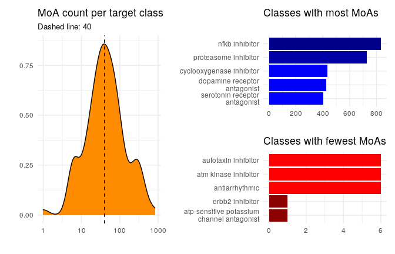
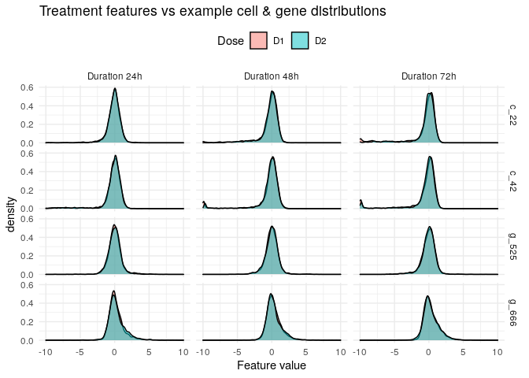
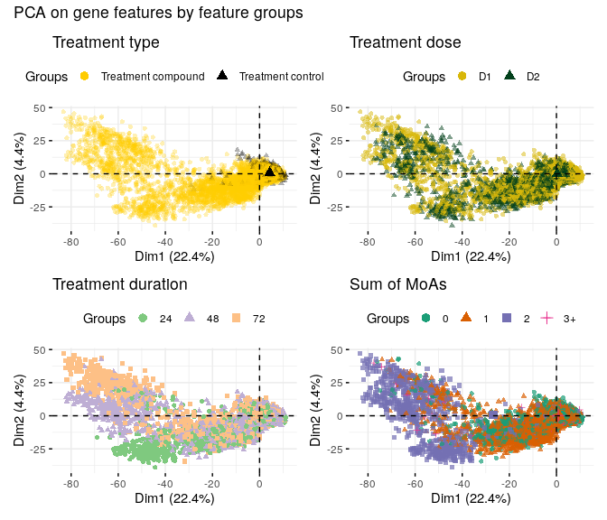

# Explorations of Action - MoA 


*Photo by @freestocks on Unsplash.*


# Introduction

The aim of this challenge is to "classify drugs based on their biological activity". Pharmaceutical drug discovery aims to identify certain proteins that are associated with a specific disease, and then to develop molecules that can target those proteins. The MoA of a molecule encodes its biological activity. Our dataset describes the responses of 100 different types of human cells to various drugs. Those response patterns will be used to classify the MoA reponse.

This is a **multi-label classification problem**. Drugs can have multiple MoA annotations which describe binary responses from different cell types in different ways. The [evaluation metric](https://www.kaggle.com/c/lish-moa/overview/evaluation) is the mean columnwise [log loss](https://www.kaggle.com/dansbecker/what-is-log-loss).

The [data](https://www.kaggle.com/c/lish-moa/data) comes in the familiear shape of train and test files. In contrast to other competitions, here we have two separate files for the training predictors (`train_features.csv`) and the targets (`train_targets_scored.csv`). Each row corresponds to a specific treatment. In addition, we are also given an optional set of MoA targets (`train_targets_nonscored.csv`) that we don't need to predict, but can use for context analysis.

The specific goal is to predict the `train_targets_scored.csv` class probabilities for the the test file `test_features.csv`. 


Let's get started!

# Preparations

## Load libraries

We load a range of libraries for general data wrangling and general visualisation together with more specialised tools for the particular job.


```r
# general visualisation
library('ggplot2') # visualisation
library('scales') # visualisation
library('patchwork') # visualisation
library('RColorBrewer') # visualisation
library('corrplot') # visualisation
library('ggthemes') # visualisation
library('viridis') # visualisation
library('glue') # visualisation

# general data manipulation
library('dplyr') # data manipulation
library('readr') # input/output
library('vroom') # input/output
library('skimr') # overview
library('tibble') # data wrangling
library('tidyr') # data wrangling
library('stringr') # string manipulation
library('forcats') # factor manipulation
library('janitor') # data cleaning
library('tictoc') # timing

# specific visualisation
library('alluvial') # visualisation
library('ggrepel') # visualisation
library('ggforce') # visualisation
library('ggridges') # visualisation
library('gganimate') # animations
library('GGally') # visualisation
library('wesanderson') # visualisation

# specific data manipulation
library('lazyeval') # data wrangling
library('broom') # data wrangling
library('purrr') # data wrangling
library('reshape2') # data wrangling
library('rlang') # encoding

# dimensionality reduction
library('factoextra')

# modelling
library('recipes')
library('rsample')
```

## Helper functions

We make use of a brief helper function to compute binomial confidence intervals.


```r
# function to extract binomial confidence levels
get_binCI <- function(x,n) {
    as.list(setNames(binom.test(x,n)$conf.int, c("lwr", "upr")))
}
```


## Load data

We use the [vroom](https://cran.r-project.org/web/packages/vroom/vignettes/vroom.html) package for reading data:


```r
train <- vroom(str_c(path,'train_features.csv'), col_types = cols())
targets <- vroom(str_c(path, "train_targets_scored.csv"), col_types = cols())
targets_non <- vroom(str_c(path, "train_targets_nonscored.csv"), col_types = cols())
test <- vroom(str_c(path,'test_features.csv'), col_types = cols())
sample_submit <- vroom(str_c(path,'sample_submission.csv'), col_types = cols())
```


# Overview: File structure and content

To start, we'll get a quick overview of the datasets and their shapes. The tables below are interactive and cover all columns for the first 50 rows:


## Training dataset


```r
head(train, 50) %>%
  DT::datatable()
```

```r
glue("Number of rows: { nrow(train) }; Number of columns { ncol(train) }")
```

```
## Number of rows: 23814; Number of columns 876
```


```r
glue('Number of "g-" features: { train %>% select(starts_with("g-")) %>% ncol() }; Number of "c-" features: { train %>% select(starts_with("c-")) %>% ncol() }')
```

```
## Number of "g-" features: 772; Number of "c-" features: 100
```


We find:

- This is a rather wide dataset with almost 900 columns. From the [data description](https://www.kaggle.com/c/lish-moa/data) we learn that features starting with "g-" encode gene expression data (there are 772 of those), and features starting with "c-" (100 in total) show cell viability data.

- In addition, we have 3 "cp_" features: `cp_type` incidates the sample treatment, while `cp_time` and `cp_dose` encode the duration and dosage of the treatment.

- The `sig_id` is the unique primary key of the sample.


## Test dataset


```r
test %>%
  head() %>%
  DT::datatable()
```


```r
glue("Number of rows: { nrow(targets) }; Number of columns { ncol(targets) }")
```

```
## Number of rows: 23814; Number of columns 207
```


We find:

- The target response are rather wide, too; with just over 200 different binary outputs. As would be expected, this table is pretty sparse.

- The `sig_id` can be used to joining the predictors to the targets.


## Non-scored targets


```r
targets_non %>%
  head(50) %>%
  DT::datatable()
```

```r
glue("Number of rows: { nrow(targets_non) }; Number of columns { ncol(targets_non) }")
```

```
## Number of rows: 23814; Number of columns 403
```


We find:

- The additional non-scored targets contain about 400 classes (i.e. columns); twice as many as our scored targets.

- That's quite a lot of additional information about the drugs themselves. Let's see whether we'll find a good application.


## Missing values

No missing values in either train or test data:


```r
sum(is.na(train))
```

```
## [1] 0
```

```r
sum(is.na(test))
```

```
## [1] 0
```


## Target sparsity

With so many target classes, MoAs are likely to be rare; and the `targets` dataframe will be pretty sparse. Here's the number:


```r
non_zero <- targets %>%
  select(-sig_id) %>%
  na_if(1) %>%
  is.na()

non_zero_percent <-  sum(non_zero) / (nrow(non_zero) * ncol(non_zero)) * 100

sprintf("Percentage of non-zero target class values: %.3f%%", non_zero_percent)
```

```
## [1] "Percentage of non-zero target class values: 0.343%"
```


Less than half a percent non-zero. Very imbalanced. How about the non-scored targets?


```r
non_zero <- targets_non %>%
  select(-sig_id) %>%
  na_if(1) %>%
  is.na()

non_zero_percent <-  sum(non_zero) / (nrow(non_zero) * ncol(non_zero)) * 100

sprintf("Percentage of non-zero non-scored target class values: %.3f%%", non_zero_percent)
```

```
## [1] "Percentage of non-zero non-scored target class values: 0.052%"
```

Wow; that is a big difference. Almost an order of magnitude more sparse than the already sparse scoring targets.


## Quality checks

First, a quick quality check, to make sure that our `sig_id` values are indeed unique. Results should be zero:


```r
nrow(train) - nrow(train %>% distinct(sig_id))
```

```
## [1] 0
```


```r
nrow(targets) - nrow(targets %>% distinct(sig_id))
```

```
## [1] 0
```


Then, another check to confirm whether `train` and `target` `sig_id` values match. Result should be zero, too:


```r
train %>%
  select(sig_id) %>%
  anti_join(targets, by = "sig_id") %>%
  nrow()
```

```
## [1] 0
```

Everything looks as expected; very good.


# Individual feature visualisations

We start by plotting the distributions of the various predictor and target features individually, before moving on to multi-feature visuals and correlations. Here, we're dealing with the features group by group.


## Treatment features

Those are the predictor features that describe more generally how the sample was treated, in terms of dose, duration; and whether it was a "real" treatment or a control.


```r
p1 <- train %>%
  count(cp_type) %>%
  add_tally(n, name = "total") %>%
  mutate(perc = n/total) %>%
  ggplot(aes(cp_type, perc, fill = cp_type)) +
  geom_col() +
  geom_text(aes(label = sprintf("%s", n)), nudge_y = 0.02) +
  scale_y_continuous(labels = scales::percent) +
  scale_fill_manual(values = c("grey70", "violetred")) +
  theme_hc() +
  theme(legend.position = "none", plot.subtitle = element_text(size = 10)) +
  labs(x = "", y = "", fill = "State", title = "Sample treatment", subtitle = "(Compound vs Control)")

p2 <- train %>%
  count(cp_dose) %>%
  add_tally(n, name = "total") %>%
  mutate(perc = n/total) %>%
  ggplot(aes(cp_dose, perc, fill = cp_dose)) +
  geom_col() +
  geom_text(aes(label = sprintf("%s", n)), nudge_y = 0.02) +
  scale_y_continuous(labels = scales::percent) +
  scale_fill_manual(values = c("darkblue", "darkred")) +
  theme_hc() +
  theme(legend.position = "none", plot.subtitle = element_text(size = 10)) +
  labs(x = "", y = "", fill = "State", title = "Treatment Dose", subtitle = "(high vs low)")

p3 <- train %>%
  count(cp_time) %>%
  mutate(cp_time = as.factor(cp_time)) %>%
  add_tally(n, name = "total") %>%
  mutate(perc = n/total) %>%
  ggplot(aes(cp_time, perc, fill = cp_time)) +
  geom_col() +
  geom_text(aes(label = sprintf("%s", n)), nudge_y = 0.01) +
  scale_y_continuous(labels = scales::percent) +
  scale_fill_brewer(type = "seq", palette = "Oranges") +
  theme_hc() +
  theme(legend.position = "none", plot.subtitle = element_text(size = 10)) +
  labs(x = "", y = "", fill = "State", title = "Treatment duration", subtitle = "(Units of hours)")

p1 + p2 + p3
```

<div class="figure">

<p class="caption">Fig. 1</p>
</div>


We find:

- The vast majority of treatments are compund treatments ("trt_cp"), compared to about 8% of control pertubation treatements ("ctl_vehicle"). Controls have no MoAs.

- The treatment dose has two categories, D1 vs D2, which encode high vs low doses. Those are approximately evenly balanced, as are the 3 treatment duration categories of 24h, 48h, or 72h.


## Gene expression features

Those are essentially anonymised features, labelled from "g-0" to "g-771". Their values are numeric, so let's look at the densities for the first 4 gene features as an example:


```r
train %>%
  select(sig_id, starts_with("g-")) %>%
  select(seq(1,5)) %>%
  pivot_longer(starts_with("g-"), names_to = "feature", values_to = "value") %>%
  ggplot(aes(value, fill = feature)) +
  geom_density() +
  facet_wrap(~ feature) +
  theme_minimal() +
  theme(legend.position = "none") +
  labs(x = "", y = "", fill = "State", title = "Distributions for gene expression features")
```

<div class="figure">

<p class="caption">Fig. 2</p>
</div>


We find:

- Those distributions look pretty normal, which is good. There's a bit of skew in some of them, but nothing that should warrant a transformation.


```r
gene_stats <- train %>%
  select(starts_with("g-")) %>%
  summarise(across(everything(), list(min = min, max = max, mean = mean, sd = sd))) %>%
  pivot_longer(starts_with("g-"), names_to = "features", values_to = "values") %>%
  separate(features, into = c("features", "stat"), sep = "_")
```


```r
gene_stats %>%
  ggplot(aes(values, fill = stat)) +
  geom_density() +
  scale_fill_manual(values = wes_palette("GrandBudapest2")) +
  facet_wrap(~ stat, scales = "free") +
  theme_tufte() +
  theme(legend.position = "none") +
  labs(x = "", y = "", fill = "State", title = "Gene distribution meta statistics")
```

<div class="figure">

<p class="caption">Fig. 3</p>
</div>

We find:

- The means are pretty nicely distributed around zero; with standard deviations chiefly between 0.5 and 1.5.

- The min and max are a nice mirror image of each other. There are notable increases around the range of positive/negative 9 - 10.


## Cell viability features

Similar to the gene features, the cell viability features are anonymous, labelled from "c-0" to "c-99"; 100 features. Their distributions look as follows:


```r
train %>%
  select(sig_id, starts_with("c-")) %>%
  select(seq(1,5)) %>%
  pivot_longer(starts_with("c-"), names_to = "feature", values_to = "value") %>%
  ggplot(aes(value, fill = feature)) +
  geom_density() +
  scale_fill_brewer(palette = "Set3") +
  facet_wrap(~ feature) +
  theme_minimal() +
  theme(legend.position = "none", plot.subtitle = element_text(size = 10)) +
  labs(x = "", y = "", fill = "State", title = "Distributions for cell viability features")
```

<div class="figure">

<p class="caption">Fig. 4</p>
</div>


We find:

- Also reasonably normal, but with notable bumps around values of -10. Are those genuine? Worth looking into this in more detail in the following.

- In contrast to the gene data, none of those distributions goes even near values of positive 10. This might be a sampling effect, though, since both this panel and the gene facets are scaled to the global min & max within each four features.


Let's zoom into the negative tails, and add 2 more features:


```r
train %>%
  select(sig_id, starts_with("c-")) %>%
  select(seq(1,7)) %>%
  pivot_longer(starts_with("c-"), names_to = "feature", values_to = "value") %>%
  filter(value < -4) %>%
  ggplot(aes(value, fill = feature)) +
  geom_density() +
  scale_fill_brewer(palette = "Set3") +
  facet_wrap(~ feature) +
  theme_minimal() +
  theme(legend.position = "none", plot.subtitle = element_text(size = 10)) +
  labs(x = "", y = "", title = "Cell viability features - zoom in on negative tail")
```

<div class="figure">

<p class="caption">Fig. 5</p>
</div>


We find:

- Those tails are definitely significant. Even in the cases where the densities don't rise near -10, the distributions look far from normal.

- Several of the features look almost multimodal. This could become a useful consideration for preprocessing steps.


Similar to the gene features, once more, let's derive and plot the distributions of meta features:


```r
cell_stats <- train %>%
  select(starts_with("c-")) %>%
  summarise(across(everything(), list(min = min, max = max, mean = mean, sd = sd))) %>%
  pivot_longer(starts_with("c-"), names_to = "features", values_to = "values") %>%
  separate(features, into = c("features", "stat"), sep = "_")
```


```r
cell_stats %>%
  ggplot(aes(values, fill = stat)) +
  geom_density() +
  scale_fill_manual(values = wes_palette("GrandBudapest1")) +
  facet_wrap(~ stat, scales = "free") +
  theme_tufte() +
  theme(legend.position = "none") +
  labs(x = "", y = "", fill = "State", title = "Cell distribution meta statistics")
```

<div class="figure">

<p class="caption">Fig. 6</p>
</div>

We find:

- What a sharp contrast to the gene meta distributions. Most obviously, the minima are nearly all below -9.5, rising up to the border of -10. The maxima show a much broader distribution between 3 and 5.

- As a consequence of this imbalance, the means are shifted towards negative values around -0.5. Note, that none of the means is above zero. The distribution of standard deviations is shifted from around 1 to around 2, compared to the gene data, with a notable tail towards small values.


## Targets

All the targets are binary columns, indicating whether a certain cell type responds to the drug, or not. Some target classes also measure the type of response; e.g. there is an `adrenergic_receptor_agonist` class and an `adrenergic_receptor_antagonist` class. Those should probably not be active for the same sample row.

Our challenge is a **multi-label classification problem**, and as such the rows (i.e. drug samples) can have multiple MoA's (i.e. more than one target class can be active). Let's first look at the distribution of how many target classes can be active at once.


```r
rowstats <- targets %>%
  select(-sig_id) %>%
  rowwise() %>%
  mutate(sum = sum(c_across(everything()))) %>%
  select(sum) %>%
  ungroup()
```


```r
rowstats %>%
  count(sum) %>%
  add_tally(n, name = "total") %>%
  mutate(perc = n/total) %>%
  mutate(sum = as.factor(sum)) %>%
  ggplot(aes(sum, n, fill = sum)) +
  geom_col() +
  geom_text(aes(label = sprintf("%.2f%%", perc*100)), nudge_y = 500) +
  # scale_y_continuous(labels = scales::percent) +
  scale_fill_brewer(palette = "Set2") +
  theme_minimal() +
  theme(legend.position = "none", plot.subtitle = element_text(size = 10)) +
  labs(x = "", y = "", title = "Number of Activations per Sample")
```

<div class="figure">

<p class="caption">Fig. 7</p>
</div>

We find:

- About 39% of training samples have no MoA annotations at all (e.g. all the target classes have values of zero). This goes a certain way to explain the sparse target dataframe, if 40% of it are completely empty.

- The largest group, with a bit more than 50% of samples, has exactly 1 MoA annotation (e.g. one class = one value of "1" in its row).

- For more than 1 MoA annotation, we see a tail that extends down to 7 simultaneous MoAs (for 0.03% of cases). Only the case of 2 MoAs is just above 5%, and 3 MoAs is slighly above 1%. Every other case is significantly rarer. Note, that there is no instance with 6 MoAs.


Looking at the targets from a different angle: which classes have the most instances of MoAs in our training data? I.e. which columns have the most 1s among the zeros? For this, we only have to sum all columns. The we plot the resulting distributions and look at the top and bottom classes. Note the logarithmic x-axis on the density plot:


```r
target_sums <- targets %>%
  select(-sig_id) %>%
  summarise(across(everything(), sum)) %>%
  pivot_longer(everything(), names_to = "target", values_to = "sum")
```


```r
p1 <- target_sums %>%
  ggplot(aes(sum)) +
  geom_density(fill = "darkorange") +
  geom_vline(xintercept = 40, linetype = 2) +
  scale_x_log10() +
  theme_minimal() +
  theme(legend.position = "none", plot.subtitle = element_text(size = 10)) +
  labs(x = "", y = "", title = "MoA count per target class", subtitle = "Dashed line: 40")

p2 <- target_sums %>%
  arrange(desc(sum)) %>%
  head(5) %>%
  mutate(target = str_replace_all(target, "_", " ")) %>%
  ggplot(aes(reorder(target, sum, FUN = min), sum, fill = sum)) +
  geom_col() +
  coord_flip() +
  scale_fill_gradient(low = "blue1", high = "blue4") +
  scale_x_discrete(labels = function(x) lapply(str_wrap(x, width = 25), paste, collapse="\n")) +
  theme_minimal() +
  theme(legend.position = "none", plot.subtitle = element_text(size = 10)) +
  labs(x = "", y = "", title = "Classes with most MoAs")

p3 <- target_sums %>%
  arrange(sum) %>%
  head(5) %>%
  mutate(target = str_replace_all(target, "_", " ")) %>%
  ggplot(aes(reorder(target, sum, FUN = min), sum, fill = sum)) +
  geom_col() +
  coord_flip() +
  scale_fill_gradient(low = "red4", high = "red1") +
  scale_x_discrete(labels = function(x) lapply(str_wrap(x, width = 25), paste, collapse="\n")) +
  theme_minimal() +
  theme(legend.position = "none", plot.subtitle = element_text(size = 10)) +
  labs(x = "", y = "", title = "Classes with fewest MoAs")

p1 + (p2/p3)
```

<div class="figure">

<p class="caption">Fig. 8</p>
</div>


We find:

- Most classes have between about 10 and 200 MoAs within the 24k rows of training samples. The dashed line marks the peak at 40. The maximum number of active rows is just above 800, and the minimum number is 1.

- The rare case of only 1 positive MoA is measured for the two dark-red cases in the bottom right panel. The top scoring classes can be seen in the top right panel. Both extremes feature mostly inhibitors and antagonists.


As so often, this last observation opens up another avenue of investigation. Even though the class names say very little to a layman like me, I can't help to notice that there's quite a few "inhibitors", "antagonists", "agonists", and so forth. Let's try to extract those and look at their frequencies. Not all class names will fall neatly within these groups, so we only look at those that occur more than once. The idea is to use the name of the class and to extract the last word of it. Here are the resulting frequencies:

```r
target_sums %>%
  separate(target, into = c("a", "b", "c", "d", "e", "type"), fill = "left") %>%
  count(type) %>%
  add_tally(n, name = "total") %>%
  mutate(perc = n/total) %>%
  filter(n > 1) %>%
  ggplot(aes(reorder(type, n, FUN = min), n, fill = n)) +
  geom_col() +
  geom_text(aes(label = sprintf("%.2f%%", perc*100)), nudge_y = 6) +
  coord_flip() +
  scale_fill_viridis() +
  scale_x_discrete(labels = function(x) lapply(str_wrap(x, width = 25), paste, collapse="\n")) +
  theme_minimal() +
  theme(legend.position = "none", plot.subtitle = element_text(size = 10)) +
  labs(x = "", y = "", title = "Common final terms in class names")
```

<div class="figure">

<p class="caption">Fig. 9</p>
</div>

We find:

- There's quite a lot of common ground in the class names: more than 50% are "inhibitors", "antagonists" and "agonists" are at comparable level of around 15% each, and the remaining three terms are much rarer.

- Everything else, about 12% of classes, have names that don't fall into these simple patterns.


# Multiple feature interaction visuals

Now that we have a much better idea of how the individual features behave, let's study their interactions. First, we will look at the different features within the same set, then expand our analysis to the interplay between those groups and their constituents. We will use the same order of feature sets as above.


## Interactions within sets of features


### Treatment features

Comparing the 3 treatment features calls for a facet grid. Two features span the horizontal and vertical grid axes, the 3rd one defines the plot within each facet:


```r
train %>%
  group_by(cp_type, cp_dose, cp_time) %>%
  count() %>%
  mutate(cp_time = as.factor(cp_time)) %>%
  ggplot(aes(cp_time, n, fill = cp_time)) +
  geom_col() +
  facet_grid(cp_dose ~ cp_type) +
  scale_fill_manual(values = wes_palette("IsleofDogs1")) +
  theme_minimal() +
  theme(legend.position = "none", plot.subtitle = element_text(size = 10)) +
  labs(x = "Treatment Duration", y = "", fill = "State",
       title = "Treatment Feature Interactions", subtitle = "Horizontal: type, Vertical: dose, Bars/Colour: duration")
```

<div class="figure">

<p class="caption">Fig. 10</p>
</div>


We find:

- The resulting picture is consistent with the overall view we saw above. Control treatments are similarly rare across doses and durations.

- One noteable difference, however, is the slightly higher percentage of 48-hour treatments for D1 doses (for both control and compound), compared to the much more equally distributed D2 bars.


### Gene expression features

Here's where things might get messy, with 772 features in this group. On the bright side, whichever method works here should also work for the smaller set of cell viability features.

Let's try something. Here are the correlations between the first 200 gene features. No labels (and no title, apparently), just colour coding for high correlations (blue) and anti-correlations (red):


```r
train %>%
  select(starts_with("g-")) %>%
  select(seq(1,200)) %>%
  cor(use="complete.obs", method = "pearson") %>%
  corrplot(type="lower", tl.col = "black",  diag=FALSE, method = "color",
           outline = FALSE, tl.pos = "n", cl.ratio = 0.05)
```

<div class="figure">

<p class="caption">Fig. 11</p>
</div>


We find:

- So, this is the big picture. It doesn't tell us much about individual features, but there's certainly some patterns to be seen.

- It looks like there's an order in which the features are at least somewhat correlated or anti-correlated; and we find that some features show very little correlation at all within those 25% of total columns.


Based on this overview, it should be sufficient to have a closer look at a subset of features. Behold: the closer look:


```r
train %>%
  select(starts_with("g-")) %>%
  select(seq(1,20)) %>%
  cor(use="complete.obs", method = "pearson") %>%
  corrplot(type="lower", tl.col = "black",  diag=FALSE, method = "color",
           cl.ratio = 0.1)
```

<div class="figure">

<p class="caption">Fig. 12</p>
</div>


We find:

- Here we have the first 20 gene features. Certain stronger correlations are apparent; such as "g-0" vs "g-8" (anti-correlation), or "g-8" vs "g-17".

- Features without much correlation include "g-18", "g-19", and also "g-2" and "g-3".


Let's look at some of these pairings in detail through scatterplots. Here, we pick 4 example pairs of features and plot them together with simple linear fits. The individual plot titles give the feature names and their Pearson correlation coefficient values:


```r
p1 <- train %>%
  janitor::clean_names() %>%
  ggplot(aes(g_0, g_8)) +
  geom_point(col = "grey40", size = 0.5) +
  geom_smooth(method = "lm", formula = "y~x", col = "darkred") +
  theme_minimal() +
  labs(title = str_c("g-0 vs g-8: coef = ", sprintf("%.2f", cor(train$`g-0`, train$`g-8`))))

p2 <- train %>%
  janitor::clean_names() %>%
  ggplot(aes(g_10, g_17)) +
  geom_point(col = "grey40", size = 0.5) +
  geom_smooth(method = "lm", formula = "y~x", col = "darkblue") +
  theme_minimal() +
  labs(title = str_c("g-10 vs g-17: coef = ", sprintf("%.2f", cor(train$`g-10`, train$`g-17`))))

p3 <- train %>%
  janitor::clean_names() %>%
  ggplot(aes(g_0, g_3)) +
  geom_point(col = "grey40", size = 0.5) +
  geom_smooth(method = "lm", formula = "y~x", col = "black") +
  theme_minimal() +
  labs(title = str_c("g-0 vs g-3: coef = ", sprintf("%.2f", cor(train$`g-0`, train$`g-3`))))

p4 <- train %>%
  janitor::clean_names() %>%
  ggplot(aes(g_10, g_19)) +
  geom_point(col = "grey40", size = 0.5) +
  geom_smooth(method = "lm", formula = "y~x", col = "black") +
  theme_minimal() +
  labs(title = str_c("g-10 vs g-19: coef = ", sprintf("%.2f", cor(train$`g-10`, train$`g-19`))))


(p1 + p2) / (p3 + p4)
```

<div class="figure">

<p class="caption">Fig. 13</p>
</div>


We find:

- Those relationships are certainly not trivial. Even for the instances of near zero correlation, the shape of the point cloud is elongated and suggests multiple modes (e.g. "g-10" vs "g-19").

- The correlated features aren't straightforward either: "g-0" vs "g-8" shows at least 2 different clusters of points together with a concentration at `g-8 == -10`. In "g-10" vs "g-17" we see a similar picture as for "g-10" vs "g-19", only somewhat rotated to achieve a 0.5 correlation.


### Cell viability features

Now we can do the same analysis for the cell viability features. Here we have fewer features ("only" 100) to begin with. First, the overview correlation plot:


```r
train %>%
  select(starts_with("c-")) %>%
  cor(use="complete.obs", method = "pearson") %>%
  corrplot(type="lower", tl.col = "black",  diag=FALSE, method = "color",
           outline = FALSE, tl.pos = "n", cl.ratio = 0.05)
```

<div class="figure">

<p class="caption">Fig. 14</p>
</div>


We find:

- Looks rather different than above, to say the least. However, given what we had seen above for the distributions skewed towards -10, this picture is not entirely unexpected.

- It's worth considering removing those extreme negative values to learn more about the relations between the remaining data points.


A closer look at the first 10 features will suffice at this point. Here we choose a display variant that displays the coefficient values directly, with a colour coding equivalent to the one above:


```r
train %>%
  select(starts_with("c-")) %>%
  select(seq(1,10)) %>%
  cor(use="complete.obs", method = "pearson") %>%
  corrplot(type="lower", tl.col = "black",  diag=FALSE, method = "number",
           cl.ratio = 0.1)
```

<div class="figure">

<p class="caption">Fig. 15</p>
</div>


We find:

- Values vary between 0.75 and 0.9. Those are reasonably strong correlations, but I fear that the negative outliers (if they are indeed outliers) are dominating this picture.


Let's have a closer look at scatterplots:


```r
p1 <- train %>%
  janitor::clean_names() %>%
  ggplot(aes(c_1, c_2)) +
  geom_point(col = "grey40", size = 0.5) +
  geom_smooth(method = "lm", formula = "y~x", col = "darkblue") +
  theme_minimal() +
  labs(title = str_c("c-1 vs c-2: coef = ", sprintf("%.2f", cor(train$`c-1`, train$`c-2`))))

p2 <- train %>%
  janitor::clean_names() %>%
  ggplot(aes(c_3, c_4)) +
  geom_point(col = "grey40", size = 0.5) +
  geom_smooth(method = "lm", formula = "y~x", col = "darkblue") +
  theme_minimal() +
  labs(title = str_c("c-3 vs c-4: coef = ", sprintf("%.2f", cor(train$`c-3`, train$`c-4`))))

p3 <- train %>%
  janitor::clean_names() %>%
  ggplot(aes(c_5, c_9)) +
  geom_point(col = "grey40", size = 0.5) +
  geom_smooth(method = "lm", formula = "y~x", col = "darkblue") +
  theme_minimal() +
  labs(title = str_c("c-5 vs c-9: coef = ", sprintf("%.2f", cor(train$`c-5`, train$`c-9`))))

p4 <- train %>%
  janitor::clean_names() %>%
  ggplot(aes(c_0, c_6)) +
  geom_point(col = "grey40", size = 0.5) +
  geom_smooth(method = "lm", formula = "y~x", col = "darkblue") +
  theme_minimal() +
  labs(title = str_c("c-0 vs c-6: coef = ", sprintf("%.2f", cor(train$`c-0`, train$`c-6`))))

(p1 + p2) / (p3 + p4)
```

<div class="figure">

<p class="caption">Fig. 16</p>
</div>


We find:

- Well, I stand corrected. The -10 values are certainly playing a role here, but even without them there is plenty of correlation left in the main cluster of points.

- Again, we can see instances of multiple sub-clusters together with potential outliers.


## Interactions between sets of features

In the previous section, we didn't look at every single feature interaction among the numerous gene expression or cell viability columns, but we got a pretty good overview of the strength of correlations and studied a few specific examples in more detail. Now, let's look at how the different sets of treatment, gene, and cell features interact with each other, before ultimately including the target features.


### Predictor features

Here, we'll look at interaction effects between features from the three different sets treatment, gene, and cell.


Let's start with breaking down by treatment features the distributions of 4 gene and cell features that were chosen completely at random. (Or were they?) Here, the 4 features are arranged vertically while the treatment duration defines the horizonal facets. The treatment dose is colour-coded. The area where both distributions overlap is a mix between both colours:


```r
train %>%
  janitor::clean_names() %>%
  select(cp_dose, cp_time, g_525, g_666, c_42, c_22) %>%
  mutate(cp_time = as.factor(str_c("Duration ", cp_time, "h"))) %>%
  pivot_longer(starts_with(c("g_", "c_")), names_to = "feature", values_to = "value") %>%
  ggplot(aes(value, fill = cp_dose)) +
  geom_density(alpha = 0.5) +
  facet_grid(feature ~ cp_time) +
  theme_minimal() +
  theme(legend.position = "top") +
  labs(x = "Feature value", fill = "Dose", title = "Treatment features vs example cell & gene distributions")
```

<div class="figure">

<p class="caption">Fig. 17</p>
</div>


We find:

- There is almost no difference between the doses in each facet: the colours overlap near perfectly.

- Similarly, any deviations between treatment durations on the same gene or cell feature are marginal at best.


No real difference for the bulk of the distributions, but what about the tails of the cell features? Let's have a closer look in the style of Fig. 5.


```r
train %>%
  select(cp_time, cp_dose, starts_with("c-")) %>%
  mutate(cp_time = as.factor(str_c("Duration ", cp_time, "h"))) %>%
  select(seq(1,5)) %>%
  pivot_longer(starts_with("c-"), names_to = "feature", values_to = "value") %>%
  filter(value < -4) %>%
  ggplot(aes(value, fill = cp_dose)) +
  geom_density(alpha = 0.5) +
  facet_grid(feature ~ cp_time) +
  theme_minimal() +
  theme(legend.position = "top", plot.subtitle = element_text(size = 10)) +
  labs(x = "", y = "", fill = "Dose", title = "Treatment vs cell - zoom in on negative tail")
```

<div class="figure">

<p class="caption">Fig. 18</p>
</div>


We find:

- There's certainly more variance here. However, keep in mind that while this negative tail is significant, the overall numbers are still relatively low.

- We see differences between doses, especially for shorter treatment durations, but bigger differences still exist between durations. For instance, compare 24-hour vs 48-hour duration for "c-0", where the mass of the (truncated) distribution is on the other side of the (truncated) x-axis range.


Now, there's one more treatment feature left that we haven't looked at, yet: namely `cp_type`: specifying whether we have a real, compound drug treatment (`trt_cp`) or a control pertubation (`ctl_vehicle`). The control shouldn't have MoAs, but can teach us something about the feature variance without the presence of drugs. Therefore, we would expect some more notable differences for control vs compound:


```r
train %>%
  janitor::clean_names() %>%
  select(cp_type, g_8, g_525, g_666, c_14, c_42, c_22) %>%
  pivot_longer(starts_with(c("g_", "c_")), names_to = "feature", values_to = "value") %>%
  ggplot(aes(value, fill = cp_type)) +
  geom_density(alpha = 0.5) +
  facet_wrap(~ feature)+
  theme_minimal() +
  theme(legend.position = "top") +
  labs(x = "Feature value", fill = "Type", title = "Treatment features vs example cell & gene distributions")
```

<div class="figure">

<p class="caption">Fig. 19</p>
</div>

We find:

- Well, now we're getting somewhere. Not all features show differences, but "g-8" and specifically "g-525" show exhibit clearly shifted distributions for control vs compound.

- It's not immediately clear how much this could help in predicting MoAs, but perhaps it could inform the distinction between control and control-like (i.e. marginal) effects.


### Predictors vs Target

This all brings us to the heart of the matter: the impact of the predictor features on the target classes. This gradual build-up might appear unnecessarily extensive, but it is important to study the interactions between targets and predictors in the context of their corresponding distributions.


We'll be starting out by joining the rowwise statistic derived earlier to the the predictor features (treatement features and some selected cell and gene features).


```r
stats_all <- train %>%
  select(starts_with("cp"), num_range(prefix = "g-", c(8, 525)), num_range(prefix = "c-", c(14, 42))) %>%
  bind_cols(rowstats)
```


First of all, let's check the control pertubations. Those shouldn't have any MoAs:


```r
stats_all %>%
  group_by(cp_type, sum) %>%
  summarise(n = n()) %>%
  add_tally(n, name = "total") %>%
  ungroup() %>%
  mutate(perc = n/total) %>%
  mutate(sum = as.factor(sum)) %>%
  ggplot(aes(sum, n, fill = sum)) +
  geom_col() +
  geom_text(aes(label = sprintf("%.2f%%", perc*100)), nudge_y = 500) +
  scale_fill_brewer(palette = "Set2") +
  facet_grid(~ cp_type, scales = "free_x", space = "free_x") +
  theme_hc() +
  theme(legend.position = "none", plot.subtitle = element_text(size = 10)) +
  labs(x = "", y = "", title = "Number of Activations per type")
```

<div class="figure">

<p class="caption">Fig. 20</p>
</div>


We find:

- Control pertubations are indeed without MoA, which is expected but good to confirm. However, that still leaves about one third of the remaining compound treatments also without MoAs. Which is fine; not every trial drug will show a reponse.

- The rest of the picture is similar to what we had seen before in Fig. 7.


Next, we'll investigate whether the number of MoAs in a row influences the cell or gene distributions. Here, for the sake of sample size, we lump together the instances with 3 or more MoAs into the group "3+". We're only looking at compound treatments; e.g. no control rows. For some visual variety, we'll be using violin plots (i.e. vertical, mirrored density plots):


```r
stats_all %>%
  filter(cp_type == "trt_cp") %>%
  mutate(cp_time = as.factor(str_c("Duration ", cp_time, "h"))) %>%
  mutate(sum = if_else(sum >= 3, "3+", as.character(sum))) %>%
  mutate(sum = as.factor(sum)) %>%
  pivot_longer(starts_with(c("g-", "c-")), names_to = "feature", values_to = "value") %>%
  ggplot(aes(sum, value, fill = sum)) +
  # geom_violin(draw_quantiles = c(0.25, 0.75)) +
  geom_violin() +
  facet_grid(feature ~ cp_time) +
  theme_minimal() +
  theme(legend.position = "none") +
  labs(x = "Sum of active MoAs per row", y = "Cell or Gene values", fill = "Rowwise sum of MoAs",
       title = "Selected cell & gene distributions for different counts of MoAs per row",
       subtitle = "Facetted by cell/gene vs treatment duration")
```

<div class="figure">

<p class="caption">Fig. 21</p>
</div>


We find:

- There are notable difference between those cases with 0 or 1 vs 2 or more MoAs. In particular, the 2 MoA category appears to account for most of the negative tail in the cell features (and some genes, too; check out "g-8"). In contrast, the "3+" group looks more similar to the "0" and "1" group (except with smaller sample sizes).

- There are some slight differences between the `cp_time` durations for the "2" and "3+" groups. Both the "0" and the "1" group look pretty stable across the board.


This looks promising. Now we can do something similar for the treatment doses. Let's go back to density plots, and choose the colour-coding for the dose feature while the facet grid is spanned by the gene and cell. The idea here is to really tease out dose variations in the presence of MoA differences:


```r
stats_all %>%
  filter(cp_type == "trt_cp") %>%
  mutate(sum = if_else(sum >= 3, "3+", as.character(sum))) %>%
  mutate(sum = as.factor(sum)) %>%
  pivot_longer(starts_with(c("g-", "c-")), names_to = "feature", values_to = "value") %>%
  ggplot(aes(value, fill = cp_dose)) +
  geom_density(alpha = 0.5) +
  facet_grid(feature ~ sum) +
  theme_minimal() +
  theme(legend.position = "top") +
  labs(y = "", x = "Cell or Gene values", fill = "Dose",
       title = "Selected cell & gene distributions for different counts of MoAs per row",
       subtitle = "Colour-coded treatment dose")
```

<div class="figure">

<p class="caption">Fig. 22</p>
</div>


We find:

- As for dose differences, there don't seem to be any. Almost all distributions show perfect overlap.

- Those density plots provide another angle to highlight the stark difference between the "MoA = 2" group and everything else.


In addition, let's look at individual target classes and their correlations with predictor features. To give us some statistics to play with, but also avoid the most extreme case, I'll choose the "dopamine receptor antagonist" using Fig. 8.


```r
foo <- train %>%
  select(starts_with("cp"), num_range(prefix = "g-", c(8, 525)), num_range(prefix = "c-", c(14, 42))) %>%
  bind_cols(rowstats) %>%
  bind_cols(targets %>% select(dopamine_receptor_antagonist)) %>%
  filter(cp_type == "trt_cp") %>%
  pivot_longer(starts_with(c("g-", "c-")), names_to = "feature", values_to = "value") %>%
  select(-cp_type) %>%
  mutate(dopamine_receptor_antagonist = as.factor(dopamine_receptor_antagonist))

foo %>%
  ggplot(aes(value, fill = dopamine_receptor_antagonist)) +
  geom_density(alpha = 0.5) +
  facet_wrap(~ feature) +
  theme_minimal() +
  theme(legend.position = "top") +
  labs(y = "", x = "Cell or Gene values", fill = "Class value",
       title = "Selected cell & gene distributions for specific class",
       subtitle = "Example: dopamine receptor antagonist")
```

<div class="figure">

<p class="caption">Fig. 23</p>
</div>


We find:

- Now, this is interesting for various reasons. First, we have slight but notable shifts in the distribution density (and mean) for the "g-" features. While subtle, on aggregate those shifts could become useful.

- But mostly there's a hint in the "c-" features that the extreme negative tail is dominated by values of zero.


Let's investigate this in more detail by borrowing the approach of Fig. 5. We'll grab another high-scoring class from Fig. 8 and zoom in on the negative tails:


```r
foo <- train %>%
  select(cp_type, num_range(prefix = "c-", seq(1,4))) %>%
  bind_cols(rowstats) %>%
  bind_cols(targets %>% select(dopamine_receptor_antagonist, cyclooxygenase_inhibitor)) %>%
  filter(cp_type == "trt_cp") %>%
  pivot_longer(starts_with(c("g-", "c-")), names_to = "feature", values_to = "value") %>%
  select(-cp_type) %>%
  filter(value < -1) %>%
  pivot_longer(c(dopamine_receptor_antagonist, cyclooxygenase_inhibitor), names_to = "class_name", values_to = "class_value") %>%
  mutate(class_value = as.factor(class_value))

foo %>%
  ggplot(aes(value, fill = class_value)) +
  geom_density(alpha = 0.5) +
  facet_grid(class_name ~ feature) +
  theme_minimal() +
  theme(legend.position = "top") +
  labs(y = "", x = "Cell values", fill = "Class value",
       title = "First cell feature distributions for specific class",
       subtitle = "Example: dopamine receptor antagonist")
```

<div class="figure">

<p class="caption">Fig. 24</p>
</div>


We find:

- Indeed, the distributions are very different here. For "dopamine", pretty much everything below -2.5 is associated with value zero.

- For "cyclooxygenase", the situation is a bit more complex, but the distributions for "class value == 1" are certainly much narrower than for the zero values.


# Non-scored targets

So far, we have been largely ignoring the non-scored target data provided in `train_targets_nonscored.csv`, other than peeking into it and noticing its sparsity at the beginning. Let's take a bit of time now to have a closer look at this dataset.


We will start by studying its properties in a similar way as for the scoring targets above. As for the rest of this notebook, all multi-plot layouts are powered by the fantastic [patchwork](https://patchwork.data-imaginist.com/) package:


```r
rowstats_non <- targets_non %>%
  select(-sig_id) %>%
  rowwise() %>%
  mutate(sum = sum(c_across(everything()))) %>%
  select(sum) %>%
  ungroup()

target_sums_non <- targets_non %>%
  select(-sig_id) %>%
  summarise(across(everything(), sum)) %>%
  pivot_longer(everything(), names_to = "target", values_to = "sum")
```


```r
p1 <- rowstats_non %>%
  count(sum) %>%
  add_tally(n, name = "total") %>%
  mutate(perc = n/total) %>%
  mutate(sum = as.factor(sum)) %>%
  ggplot(aes(sum, n, fill = sum)) +
  geom_col() +
  geom_text(aes(label = sprintf("%.2f%%", perc*100)), nudge_y = 1000) +
  # scale_y_continuous(labels = scales::percent) +
  scale_fill_brewer(palette = "Set2") +
  theme_tufte() +
  theme(legend.position = "none", plot.subtitle = element_text(size = 10)) +
  labs(x = "", y = "", title = "Number of Activations per Sample Row")

p2 <- target_sums_non %>%
  ggplot(aes(sum)) +
  geom_density(fill = "darkorange") +
  geom_vline(xintercept = 6, linetype = 2) +
  scale_x_continuous(trans = "log1p", breaks = c(0, 10, 20, 50, 100)) +
  theme_tufte() +
  theme(legend.position = "none", plot.subtitle = element_text(size = 10)) +
  labs(x = "", y = "", title = "MoA count per target class", subtitle = "Dashed line: 6")

p3 <- target_sums_non %>%
  arrange(desc(sum)) %>%
  head(5) %>%
  mutate(target = str_replace_all(target, "_", " ")) %>%
  ggplot(aes(reorder(target, sum, FUN = min), sum, fill = sum)) +
  geom_col() +
  coord_flip() +
  scale_fill_gradient(low = "blue1", high = "blue4") +
  scale_x_discrete(labels = function(x) lapply(str_wrap(x, width = 25), paste, collapse="\n")) +
  theme_tufte() +
  theme(legend.position = "none", plot.subtitle = element_text(size = 10)) +
  labs(x = "", y = "", title = "Classes with most MoAs")

p1 / (p2 + p3) + plot_annotation(title = 'Non-scored target data')
```

<div class="figure">

<p class="caption">Fig. 25</p>
</div>


We find:

- As we saw above, this extra dataframe is significantly more sparse than our scored target data: 80% of rows (i.e. drug molecules) have no MoAs at all, compared to 40% in the scored targets.

- Interestingly enough, the MoA counts remain the same, though: the maximum is 7, and there is no case with 6.

- Consequently, the distribution of MoA counts per target class is significantly shifted to the left, compared to Fig. 8. There are now classes without any MoAs at all; which is not the case for the scored targets.

- The top-MoA classes have counts in the high tens instead of high hundreds. All are "inhibitors".


What about those type-level part of the class names? Here is the equivalent plot to Fig. 9:


```r
target_sums_non %>%
  separate(target, into = c("a", "b", "c", "d", "e", "f", "g", "type"), fill = "left") %>%
  count(type) %>%
  add_tally(n, name = "total") %>%
  mutate(perc = n/total) %>%
  filter(n > 1) %>%
  ggplot(aes(reorder(type, n, FUN = min), n, fill = n)) +
  geom_col() +
  geom_text(aes(label = sprintf("%.2f%%", perc*100)), nudge_y = 12) +
  coord_flip() +
  scale_fill_viridis(option = "cividis") +
  scale_x_discrete(labels = function(x) lapply(str_wrap(x, width = 25), paste, collapse="\n")) +
  theme_minimal() +
  theme(legend.position = "none", plot.subtitle = element_text(size = 10)) +
  labs(x = "", y = "", title = "Non-scored targets: Common final terms in class names")
```

<div class="figure">

<p class="caption">Fig. 26</p>
</div>

We find:

- Due to the factor 2 larger number of classes, we have a few more cases of target class types (i.e. for now the final terms in the class name) with more than 1 occurence. However, the dominating types remain the same; with "inhibitor" contributing more than 50%.

- Antagonists remain more common than agonists. There's also the odd spelling variation, e.g. "activators" instead of "activator".


# Dimensionality reduction via PCA

Given the notable amount of correlations in the gene and, especially, the cell features, let's test some dimensionality reduction methods, to see by how much we could reduce our feature space.

Here, we will focus on principal component analysis (PCA). PCA is essentially a rotation of the parameter space so that the new axes (the "principal components" aka PC) are orthogonal and align with the directions of maximum variance. We'll start with the gene features, then look at the cell features.


## Gene features


```r
X <- train %>%
  select(starts_with("g-"))

pca <- prcomp(X, center = TRUE, scale. = TRUE)
```


Our first plot will show the amount of variance explained by each PC for the first 5 PCs (a "Scree Plot"), alongside the direction and magnitude (colour) of the contribution of the original features to the first 2 PCs. The PCA visuals are produced via the excellent [factoextra package](https://cran.r-project.org/web/packages/factoextra/index.html).


```r
p1 <- fviz_eig(pca, title = "Variance", ncp = 5)
p2 <- fviz_pca_var(pca,
             col.var = "contrib",
             gradient.cols = c("#00AFBB", "#E7B800", "#FC4E07"),
             repel = TRUE,
             label = "none",
             title = "Variables"
             )

p1 + p2 + plot_annotation(title = 'PCA on gene features: overview')
```

<div class="figure">

<p class="caption">Fig. 27</p>
</div>


We find:

- There's about 25% of variance in the 1st PC, with the other PCs contributing less than 5% each; which is a notable drop.

- The variables plot shows this dominance of PC1 by most features having contributions close to the horizontal axis. The strength of the contributions appears to vary quite smoothly within the displayed range.


The variables plot in the right panel above already shows that many variables contribute in similar ways to the first 2 PCs. Here, we can have a closer look at those specific features. I'm showing the top 15 variables in each PC dimension. (The dashed horizontal line shows the expected value for a uniform distribution):


```r
p1 <- fviz_contrib(pca, choice = "var", axes = 1, top = 15)
p2 <- fviz_contrib(pca, choice = "var", axes = 2, top = 15)

p1 / p2 + plot_annotation(title = 'PCA on gene features: variable contributions')
```

<div class="figure">

<p class="caption">Fig. 28</p>
</div>


We find:

- Those plots are not particularly useful for PC1, because many different features have a similar strength of contribution. The order of these feature names doesn't necessarily reveal anything interesting, either.

- In PC2, we have "g-173" leading the pack. However, remember that this component contributes to less than 5% of the overall variance.


Now that we have the principal components, we can look at the data distribution in the new parameter space. To detect promising clusters, we will colour-code the data points by the values of the treatment features (type, dose, duration) as well as the (rowwise) sum of the MoAs:


```r
p1 <- fviz_pca_ind(pca, label = "none",
                   habillage = train %>% mutate(cp_type = if_else(cp_type == "trt_cp", "Treatment compound", "Treatment control")) %>% pull(cp_type),
                   # habillage = train$cp_type,
                   alpha.ind = 0.3,
              palette = c("#FFCC00", "black"),
             title = "Treatment type") +
  theme(legend.position = "top")

p2 <- fviz_pca_ind(pca, label = "none",
                   habillage = train$cp_dose,
                   alpha.ind = 0.5,
              palette = wes_palette("Cavalcanti1"),
             title = "Treatment dose") +
  theme(legend.position = "top")

p3 <- fviz_pca_ind(pca, label = "none",
                   habillage = train$cp_time,
                   alpha.ind = 1,
              palette = "Accent",
             title = "Treatment duration") +
  theme(legend.position = "top")


p4 <- fviz_pca_ind(pca, label = "none",
                   habillage = rowstats %>% mutate(sum = if_else(sum >= 3, "3+", as.character(sum))) %>% pull(sum),
              palette = "Dark2",
              alpha.ind = 0.7,
             title = "Sum of MoAs") +
  theme(legend.position = "top")

(p1 + p2) / (p3 + p4) + plot_annotation(title = 'PCA on gene features by feature groups')
```

<div class="figure">

<p class="caption">Fig. 29</p>
</div>


We find:

- There's quite a bit of separation and clustering here; which is promising.

- The control treatments show much tighter clustering in the first two PCs than the real compound treatments. Given their nature, this isn't too surprising.

- The distributions for doses 1 vs 2 match pretty well. This is consistent with what we had seen so far about this feature.

- The treatment durations, on the other hand, show some separation along one side of the parameter space. Similarly, the rowwise sums of MoAs suggest some clustering, especially for `sum = 2` vs 0 and 1.


## Cell features

Now we can do the same thing for the cell features. Given the strong correlations that we have seen in Figs. 14 and 15, I expect the PCA to look quite different from the gene feature findings. First the overview and variable contributions:


```r
Xc <- train %>%
  select(starts_with("c-"))

pca_cell <- prcomp(Xc, center = TRUE, scale. = TRUE)
```


```r
p1 <- fviz_eig(pca_cell, title = "Variance", ncp = 5)
p2 <- fviz_pca_var(pca_cell,
             col.var = "contrib",
             gradient.cols = c("#00AFBB", "#E7B800", "#FC4E07"),
             repel = TRUE,
             label = "none",
             title = "Variables"
             )
p3 <- fviz_contrib(pca_cell, choice = "var", axes = 1, top = 8)
p4 <- fviz_contrib(pca_cell, choice = "var", axes = 2, top = 8)

(p1 + p2) / (p3 + p4) + plot_annotation(title = 'PCA on cell features')
```

<div class="figure">

<p class="caption">Fig. 30</p>
</div>

We find:

- Yeah, those high correlations show themselves clearly in the dominance of the 1st PC.

- Contribution plots are similar to the gene features, in that many variables contribute a lot to PC1 (in a near uniform fashion) and there's a gradual decline in contribution strength for PC2.


Now the scatter plot for the instances on in the new PC space. I'll keep the colour schemes of the previous layout, so don't get confused:


```r
p1 <- fviz_pca_ind(pca_cell, label = "none",
                   habillage = train %>% mutate(cp_type = if_else(cp_type == "trt_cp", "Treatment compound", "Treatment control")) %>% pull(cp_type),
                   # habillage = train$cp_type,
                   alpha.ind = 0.3,
              palette = c("#FFCC00", "black"),
             title = "Treatment type") +
  theme(legend.position = "top")

p2 <- fviz_pca_ind(pca_cell, label = "none",
                   habillage = train$cp_dose,
                   alpha.ind = 0.5,
              palette = wes_palette("Cavalcanti1"),
             title = "Treatment dose") +
  theme(legend.position = "top")

p3 <- fviz_pca_ind(pca_cell, label = "none",
                   habillage = train$cp_time,
                   alpha.ind = 1,
              palette = "Accent",
             title = "Treatment duration") +
  theme(legend.position = "top")


p4 <- fviz_pca_ind(pca_cell, label = "none",
                   habillage = rowstats %>% mutate(sum = if_else(sum >= 3, "3+", as.character(sum))) %>% pull(sum),
              palette = "Dark2",
              alpha.ind = 0.7,
             title = "Sum of MoAs") +
  theme(legend.position = "top")

(p1 + p2) / (p3 + p4) + plot_annotation(title = 'PCA on cell features by feature groups')
```

<div class="figure">

<p class="caption">Fig. 31</p>
</div>


We find:

- Feature-wise distributions are pretty similar to what we've seen in the gene variables. Compound treatments much more extended than control, D1 and D2 overlap  closely, more stratification in treatment duration and MoA sum.

- For the durations, it's particularly the 24-hour group that stands out. The 48h and 72h groups separate a bit better at the edges of the PC space, but otherwise overlap resonably closely.

- For MoA sums, it's again the `sum = 2` group which is most different from the rest.

***
***
